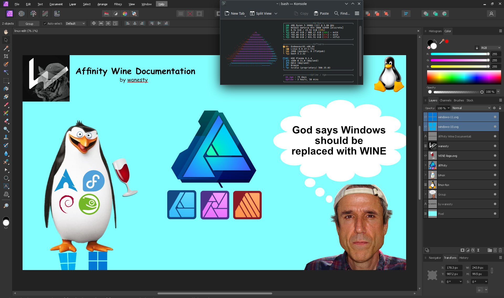

#  Affinity on Linux



---

>
> [!NOTE] This is possible thanks to:
>
> - [Affinity Wine Docs (by wanesty) - v2](https://affinity.liz.pet/v2/)
> - [wine-wintypes.dll-for-affinity (by ElementalWarrior)](https://github.com/ElementalWarrior/wine-wintypes.dll-for-affinity/)
> - [WINE (compatibility layer)](https://www.winehq.org/)

>
> [!NOTE]
> Affinity v2 (the version of Designer, Photo and Publisher released after Serif joined Canva and merged the three apps into a single "Affinity" app) now runs on **stock Wine 10.17+**, no patched/custom Wine build is required anymore.
> If you are still using an older Affinity v1/v2 release that needs ElementalWarrior's Wine fork, see the [Legacy (v1) installation](#legacy-v1-installation) section below.

## Requirements

>
> [!NOTE]
> WINE requires Xorg (Window System Display Server), if you use Wayland you need the XWayland bridge.
>

- **Wine 10.17 or newer**, **wine-mono** and **winetricks**. The setup script detects your distro (Arch, Debian/Ubuntu, Fedora, openSUSE) and installs these automatically if missing.
- The Affinity `.exe` installer(s), downloaded from your [Affinity account](https://store.serif.com/en-us/account/licenses/) (you need the `.exe` installer, MSI/MSIX installers won't work).

If your distro isn't supported by the script or ships a Wine older than `10.17`, check [Repology](https://repology.org) for the available versions and package names: [`wine`](https://repology.org/project/wine/versions), [`wine-mono`](https://repology.org/project/wine-mono/versions), [`winetricks`](https://repology.org/project/winetricks/versions).

> [!NOTE]
> If you use [NixOS](https://nixos.org/) or the [Nix](https://github.com/NixOS/nix) package manager, check out [affinity crimes](https://github.com/lf-/affinity-crimes), a scripted and fully reproducible setup with Nix.

## Installation

>
> [!WARNING]
> Review the bash script and execute at your own risk

1. Download an Affinity `.exe` installer (Designer, Photo or Publisher, they all install the same unified "Affinity" app from v2.6 onwards).
2. Run the setup script, optionally passing the path to the installer:

	```sh
	sh ./scripts/affinity-wine-v2.sh ~/Downloads/affinity-designer-msi-2.x.x.exe
	```

This will:

- Install Wine, wine-mono and winetricks if they're missing.
- Create a wineprefix at `$HOME/.wineAffinity3` (override with the `WINEPREFIX` env var).
- Install the required winetricks components (`vcrun2022`, `dotnet48`, `corefonts`, `win11`).
- Run the Affinity installer with Wine.
- Download and install [`wintypes.dll`](https://github.com/ElementalWarrior/wine-wintypes.dll-for-affinity/) and `Windows.winmd`, which let stock Wine resolve the `.winmd` dependencies Affinity needs.

Once it's done, launch Affinity with:

```sh
WINEPREFIX="$HOME/.wineAffinity3" wine "$HOME/.wineAffinity3/drive_c/Program Files/Affinity/Affinity/Affinity.exe"
```

### Legacy (v1) installation

For older Affinity releases that still require [ElementalWarrior's Wine fork](https://gitlab.winehq.org/ElementalWarrior/wine/-/commits/affinity-photo3-wine9.13-part3):

1. WINE with [rum](https://gitlab.com/xkero/rum), [a small wineprefix script](./WINE/rum/rum) (recommended), compatible with Arch, Debian, Fedora and OpenSUSE.
    - Download and execute the script [affinity-wine-rum.sh](./scripts/affinity-wine-rum.sh) running `sh ./scripts/affinity-wine-rum.sh`.

2. WINE with [Bottles](https://usebottles.com/) (not working)
    - Download and execute the script [affinity-wine-bottles.sh](./scripts/affinity-wine-bottles.sh) running `sh ./scripts/affinity-wine-bottles.sh`

## Extra: create desktop shortcut

- Create a desktop shortcut to launch Affinity from your desktop environment: [affinity.desktop](./resources/affinity.desktop). Edit the `WINEPREFIX`, executable and icon paths to match your setup (replace `USERNAME` with your username, or `$HOME/.wineAffinity` if you used the legacy v1 setup).
- For the legacy v1 (rum-based) setup, per-app shortcuts are also available:
    - [designer.desktop](./resources/designer.desktop)
    - [photo.desktop](./resources/photo.desktop)
    - [publisher.desktop](./resources/publisher.desktop)

## Troubleshooting

If you hit flickering, a pixelated UI font, panels that won't stack/save their position, or need to kill a frozen Wine/Affinity process, check the [Troubleshooting page](https://affinity.liz.pet/v2/misc-troubleshooting/) of the v2 guide.

## More

- [Affinity Wine Docs v2 (by wanesty)](https://affinity.liz.pet/v2/)
- [Affinity Photo - WineHQ AppDB](https://appdb.winehq.org/objectManager.php?sClass=application&iId=18332)
- [Affinity Suite V2 on Linux [Wine] - Affinity Forum](https://forum.affinity.serif.com/index.php?/topic/182758-affinity-suite-v204-on-linux-wine/)
- [Affinity running on Linux with Bottles - Affinity Forum](https://forum.affinity.serif.com/index.php?/topic/166159-affinity-photo-running-on-linux-with-bottles/page/8/)
- [Affinity on Linux (guides) by Seaper on GitHub](https://github.com/seapear/AffinityOnLinux)
- [Affinity on Linux (scripts) by Mattscreative](https://github.com/ryzendew/AffinityOnLinux)
